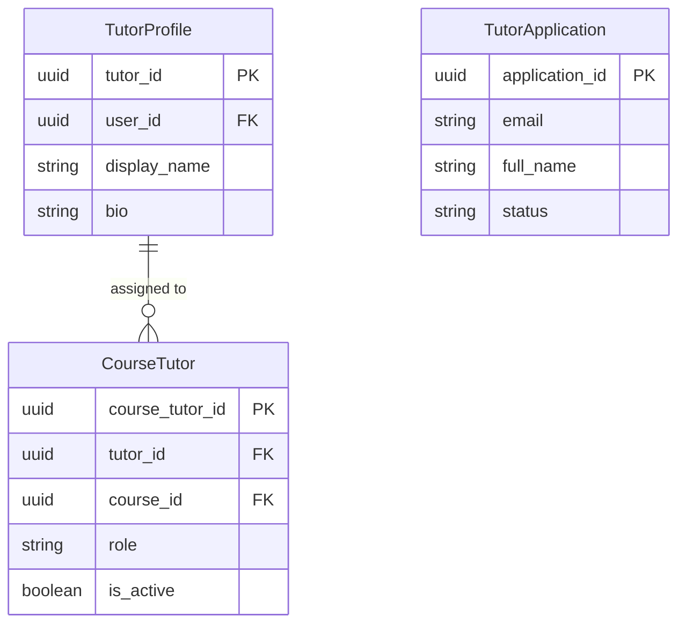
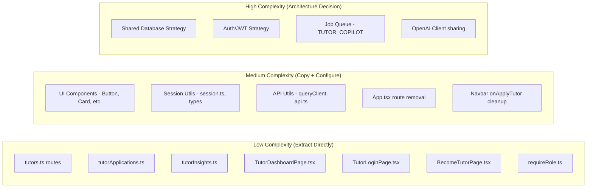

# Tutor Decoupling: Separation Strategy Report

**Phase 1 – Impact Analysis**
**Date:** 2026-02-16

---

## 1. Executive Summary

The Tutor functionality is **moderately entangled** with the core platform. It is not deeply woven into the student learning path, but it shares fundamental infrastructure: the **Users table**, the **Authentication/Session system**, and **read access to Course/Enrollment/Progress data**.

Splitting into 4 applications is feasible but requires a clear strategy for **shared data access** and **authentication**. The main risk is not code volume (tutor code is relatively small) but the **data dependency** — the tutor backend needs real-time read access to student progress, enrollments, and course content owned by the core platform.

> [!IMPORTANT]
> The single highest-risk decision is: **How do two separate backends share one database?** The options and tradeoffs are detailed in Section 5.

---

## 2. Backend Entanglement

### 2.1 Tutor-Specific Files (Safe to Extract)

These files contain *only* tutor logic and have no student-facing code paths:

| File | Purpose | Lines | Dependencies |
|---|---|---|---|
| [tutors.ts](file:///d:/BunnY/OTTOBON%20Projects/Course%20Platform%20System%20Design/backend/src/routes/tutors.ts) | 5 API endpoints (login, copilot query, my courses, enrollments, progress) | 298 | `prisma`, `sessionService`, `requireAuth`, `requireTutor`, `tutorInsights`, `openAiClient` |
| [tutorApplications.ts](file:///d:/BunnY/OTTOBON%20Projects/Course%20Platform%20System%20Design/backend/src/routes/tutorApplications.ts) | 1 endpoint (submit application) | 60 | `prisma`, `zod` |
| [tutorInsights.ts](file:///d:/BunnY/OTTOBON%20Projects/Course%20Platform%20System%20Design/backend/src/services/tutorInsights.ts) | Builds learner snapshots for tutor copilot AI | 176 | `prisma`, `date-fns` |
| [requireRole.ts](file:///d:/BunnY/OTTOBON%20Projects/Course%20Platform%20System%20Design/backend/src/middleware/requireRole.ts) | `requireTutor` middleware guard | 21 | `requireAuth` |

**Total tutor-specific backend code: ~555 lines across 4 files.**

### 2.2 Tutor API Endpoints

| Method | Path | Auth | Purpose |
|---|---|---|---|
| `POST` | `/tutors/login` | None | Email/password login for tutors |
| `POST` | `/tutors/assistant/query` | `requireAuth` + `requireTutor` | AI Copilot query |
| `GET` | `/tutors/me/courses` | `requireAuth` + `requireTutor` | List tutor's assigned courses |
| `GET` | `/tutors/:courseId/enrollments` | `requireAuth` + `requireTutor` | List enrolled students |
| `GET` | `/tutors/:courseId/progress` | `requireAuth` + `requireTutor` | Student progress breakdown |
| `POST` | `/tutor-applications/` | None | Submit a tutor application |

### 2.3 Shared/Entangled Backend Code

These files contain tutor logic **mixed with** core platform logic:

| File | Tutor Entanglement | Extraction Difficulty |
|---|---|---|
| [activityEventService.ts](file:///d:/BunnY/OTTOBON%20Projects/Course%20Platform%20System%20Design/backend/src/services/activityEventService.ts) | Contains `ensureTutorOrAdminAccess()` function and tutor event prefixes (`tutor.response`, `tutor.prompt`) | **Low** – function can be copied. |
| [jobQueueService.ts](file:///d:/BunnY/OTTOBON%20Projects/Course%20Platform%20System%20Design/backend/src/services/jobQueueService.ts) | `TUTOR_COPILOT` is one of the `JobType` enum values | **Low** – add it to tutor backend's own job types. |
| [lessons.ts](file:///d:/BunnY/OTTOBON%20Projects/Course%20Platform%20System%20Design/backend/src/routes/lessons.ts) | `tutorPersona` field used in content resolution logic | **None** – this stays in core. Tutor backend only *reads* resolved content. |
| [auth.ts](file:///d:/BunnY/OTTOBON%20Projects/Course%20Platform%20System%20Design/backend/src/routes/auth.ts) | Contains "Tutor or admin account required" check | **Low** – tutor has its own login endpoint. |
| [app.ts](file:///d:/BunnY/OTTOBON%20Projects/Course%20Platform%20System%20Design/backend/src/app.ts) | Mounts `tutorsRouter` and `tutorApplicationsRouter` | **Low** – remove two lines from core, add to tutor backend. |

---

## 3. Database Model Analysis

### 3.1 Tutor-Specific Models (Move to `tutor-backend`)

These tables are exclusively used by tutor features:



### 3.2 Shared Models (CRITICAL – Both Apps Need Access)

| Model | Core Platform Uses | Tutor Platform Uses |
|---|---|---|
| **`users`** | Auth, enrollment, progress | Login, identity, role check |
| **`courses`** | Content delivery, enrollment | Course listing, context for copilot |
| **`enrollments`** | Student access gating | Enrollment counts, learner roster |
| **`module_progress`** | Unlock next module | Completion %, at-risk detection |
| **`topics`** | Lesson rendering | Total module count for % calc |
| **`sessions`** | JWT token lifecycle | JWT token lifecycle (shared) |
| **`background_jobs`** | AI query queue | Tutor copilot queue |

> [!CAUTION]
> The tutor backend **reads** from `enrollments`, `module_progress`, `topics`, and `courses` extensively. It does **not write** to them. This is important for the shared data strategy.

---

## 4. Frontend Coupling

### 4.1 Tutor-Specific Pages (Safe to Extract)

| File | Lines | Route | Purpose |
|---|---|---|---|
| [TutorDashboardPage.tsx](file:///d:/BunnY/OTTOBON%20Projects/Course%20Platform%20System%20Design/frontend/src/pages/TutorDashboardPage.tsx) | 870 | `/tutors` | Main tutor dashboard (courses, enrollments, progress, AI copilot) |
| [TutorLoginPage.tsx](file:///d:/BunnY/OTTOBON%20Projects/Course%20Platform%20System%20Design/frontend/src/pages/TutorLoginPage.tsx) | 113 | (unused standalone) | Tutor login form |
| [BecomeTutorPage.tsx](file:///d:/BunnY/OTTOBON%20Projects/Course%20Platform%20System%20Design/frontend/src/pages/BecomeTutorPage.tsx) | 731 | `/become-a-tutor` | Application form + embedded tutor login modal |

**Total tutor-specific frontend code: ~1,714 lines across 3 files.**

### 4.2 Tutor Routes in App.tsx

```tsx
// Lines 35 and 59 in App.tsx
<Route path="/become-a-tutor" component={BecomeTutorPage} />
<Route path="/tutors"          component={TutorDashboardPage} />
```

### 4.3 Shared UI Components Used by Tutor Pages

Both tutor pages import these shared components that **must be duplicated or published as a package**:

| Component | Source | Used By |
|---|---|---|
| `Button` | `@/components/ui/button` | Both apps |
| `Card`, `CardContent`, `CardHeader` | `@/components/ui/card` | Both apps |
| `Input`, `Label` | `@/components/ui/input`, `@/components/ui/label` | Both apps |
| `Textarea` | `@/components/ui/textarea` | Both apps |
| `Badge` | `@/components/ui/badge` | Both apps |
| `Skeleton` | `@/components/ui/skeleton` | Both apps |
| `SiteLayout` | `@/components/layout/SiteLayout` | Both apps |
| `Navbar` | `@/components/layout/Navbar` | Core (has `onApplyTutor` prop) |

### 4.4 Shared Utilities

| Utility | File | Notes |
|---|---|---|
| `apiRequest` | `@/lib/queryClient` | HTTP helper – copy to tutor frontend |
| `buildApiUrl` | `@/lib/api` | Base URL builder – tutor will point to `tutor-backend` |
| `writeStoredSession` | `@/utils/session` | JWT session management – **must be identical** |
| `StoredSession` type | `@/types/session` | Session shape – **must be identical** |
| `useToast` | `@/hooks/use-toast` | Toast hook – copy |

---

## 5. Authentication & Session Strategy

### 5.1 Current State

| Aspect | Details |
|---|---|
| **User Table** | Single `users` table with a `role` enum (`learner`, `tutor`, `admin`) |
| **Student Login** | Google OAuth 2.0 → `auth.ts` → `sessionService.createSession()` |
| **Tutor Login** | Email/Password → `tutors.ts /login` → same `sessionService.createSession()` |
| **Token Format** | JWT with `sub` (userId), `sid` (sessionId), `jti` (tokenId), `role` |
| **Token Storage** | `localStorage` via `writeStoredSession()` |
| **Sessions Table** | Shared `sessions` table in the database |

### 5.2 The Core Problem

Both applications authenticate against the **same `users` table** and produce **the same JWT format**. If we split the backends:

```
Student hits tutor-backend → needs to be rejected
Tutor hits core-backend → needs to be rejected (except for shared reads)
```

### 5.3 Recommended Auth Strategy

> [!IMPORTANT]
> **Option A: Shared Database, Separate JWT Validation (Recommended)**
>
> Both backends connect to the **same database** but have their own JWT signing secrets. Each backend only accepts tokens it issued. The `role` field in the JWT provides an additional layer of access control.

| Approach | Pros | Cons |
|---|---|---|
| **A. Shared DB, Separate Secrets** | Simple, fast, no data sync | Tight DB coupling remains |
| **B. Shared DB, Same Secret** | Simplest change | Any token works on any backend (security risk) |
| **C. Separate User DBs** | Full isolation | Complex data sync, duplicate user management |
| **D. Auth Microservice** | Clean separation | Over-engineered for current scale |

---

## 6. Shared Data Strategy

The tutor backend needs **read access** to student data. Three approaches:

### Option 1: Shared Database (Recommended for Phase 1)
Both backends connect to the same PostgreSQL instance. The tutor backend has its own Prisma schema that includes the shared tables as **read-only** models.

```
┌─────────────┐     ┌─────────────┐
│ core-backend │     │tutor-backend│
│  (R/W all)   │     │ (R/W tutor) │
│              │     │ (R only     │
│              │     │  student)   │
└──────┬───────┘     └──────┬──────┘
       │                    │
       └────────┬───────────┘
                │
       ┌────────▼────────┐
       │   PostgreSQL     │
       │ (Single Instance)│
       └─────────────────┘
```

**Pros**: Zero data sync latency, simplest to implement.
**Cons**: Schema changes in core can break tutor backend. Requires coordinated deployments.

### Option 2: Internal API Gateway (Phase 2+)
The tutor backend calls the core backend's API for student data instead of querying the DB directly.

**Pros**: True decoupling, core can change schema freely.
**Cons**: Added latency, need to build internal APIs, more infrastructure.

### Option 3: Read Replica / DB Views
Tutor backend connects to a read replica or uses PostgreSQL views that expose only the data it needs.

**Pros**: Strong boundary, no write conflicts.
**Cons**: Added infra cost, replication lag.

---

## 7. Separation Complexity Summary



### Effort Estimation

| Category | Items | Estimated Effort |
|---|---|---|
| **Extract & Move** | 7 files (routes, services, pages) | 1 day |
| **Copy & Configure** | UI components, utils, env config | 1 day |
| **Architecture Decisions** | DB strategy, Auth strategy, OpenAI config | Discussion (0.5 day) |
| **Wiring & Testing** | New `tutor-backend` Express app, new `tutor-frontend` Vite app, routing | 2 days |
| **Cleanup** | Remove tutor code from core, update Navbar, update App.tsx | 0.5 day |
| **Total** | | **~5 days** |

---

## 8. Recommended Phase 1 Extraction Plan

1.  **Create `tutor-backend/`**: New Express + TypeScript project. Copy `prisma.ts`, `sessionService.ts`, `requireAuth.ts` as shared infra. Move tutor routes and services.
2.  **Create `tutor-frontend/`**: New Vite + React project. Copy `components/ui/*`, session utils, api utils. Move tutor pages.
3.  **Shared DB**: Both backends point to the same PostgreSQL. Tutor backend gets its own Prisma schema with only the models it needs.
4.  **Separate JWT Secrets**: `tutor-backend` uses `TUTOR_JWT_SECRET`. Core uses `JWT_SECRET`. Tokens are not cross-compatible.
5.  **Clean Core**: Remove tutor routes from `app.ts`, remove tutor pages from `App.tsx`, clean Navbar `onApplyTutor` prop.
6.  **`BecomeTutorPage` Decision**: This page serves both audiences (public application + tutor login). It should live on the **core frontend** (it's a marketing/application page), with the login modal redirecting to the tutor frontend URL upon success.

---

## 9. Environment Variable Configuration

### 9.1 Current Core Backend Variables (from `env.ts`)

The core backend validates 13 env variables via Zod. Here is the full mapping showing what the tutor backend needs:

| Variable | Core Backend | Tutor Backend | Notes |
|---|---|---|---|
| `NODE_ENV` | ✅ Required | ✅ Copy | Same values |
| `PORT` | `4000` | `4001` | **Different port** |
| `DATABASE_URL` | ✅ Required | ✅ **Same value** | Shared DB (Phase 1) |
| `GOOGLE_CLIENT_ID` | ✅ Required | ❌ Not needed | Tutors don't use OAuth |
| `GOOGLE_CLIENT_SECRET` | ✅ Required | ❌ Not needed | Tutors don't use OAuth |
| `GOOGLE_REDIRECT_URI` | ✅ Required | ❌ Not needed | Tutors don't use OAuth |
| `JWT_SECRET` | ✅ Required | ✅ **Different value** | Separate secret for token isolation |
| `JWT_REFRESH_SECRET` | ✅ Required | ✅ **Different value** | Separate secret for token isolation |
| `JWT_ACCESS_TOKEN_TTL_SECONDS` | `900` (15min) | ✅ Copy | Can diverge if needed |
| `JWT_REFRESH_TOKEN_TTL_DAYS` | `30` | ✅ Copy | Can diverge if needed |
| `FRONTEND_APP_URLS` | `http://localhost:5173` | `http://localhost:5174` | **Different CORS origin** |
| `GOOGLE_STATE_COOKIE_NAME` | ✅ Required | ❌ Not needed | OAuth only |
| `GOOGLE_STATE_MAX_AGE_SECONDS` | ✅ Required | ❌ Not needed | OAuth only |
| `OPENAI_API_KEY` | ✅ Required | ✅ **Same value** | Shared OpenAI account |
| `LLM_MODEL` | `gpt-3.5-turbo` | ✅ Copy | Used by tutor copilot |
| `EMBEDDING_MODEL` | `text-embedding-3-small` | ❌ Not needed | RAG pipeline is core-only |

### 9.2 Proposed `tutor-backend/.env`

```env
NODE_ENV=development
PORT=4001
DATABASE_URL=postgresql://...  # Same connection string as core

# ── Auth (SEPARATE secrets) ──────────────────────────
JWT_SECRET=<unique-32char-secret-for-tutor-backend>
JWT_REFRESH_SECRET=<unique-32char-refresh-secret-for-tutor-backend>
JWT_ACCESS_TOKEN_TTL_SECONDS=900
JWT_REFRESH_TOKEN_TTL_DAYS=30

# ── CORS ─────────────────────────────────────────────
FRONTEND_APP_URLS=http://localhost:5174

# ── AI ───────────────────────────────────────────────
OPENAI_API_KEY=sk-...
LLM_MODEL=gpt-3.5-turbo
```

### 9.3 Proposed `tutor-frontend/.env`

```env
VITE_API_BASE_URL=http://localhost:4001
```

### 9.4 `tutor-backend/src/config/env.ts` (Simplified Schema)

The tutor backend's env schema is a **stripped-down version** — 5 out of 13 variables are removed (all Google OAuth + Embedding Model):

```typescript
const envSchema = z.object({
  NODE_ENV: z.enum(["development", "test", "production"]).default("development"),
  PORT: z.coerce.number().int().positive().default(4001),
  DATABASE_URL: z.string().url(),
  JWT_SECRET: z.string().min(32),
  JWT_REFRESH_SECRET: z.string().min(32),
  JWT_ACCESS_TOKEN_TTL_SECONDS: z.coerce.number().int().positive().default(900),
  JWT_REFRESH_TOKEN_TTL_DAYS: z.coerce.number().int().positive().default(30),
  FRONTEND_APP_URLS: z.string().default("http://localhost:5174"),
  OPENAI_API_KEY: z.string().min(1),
  LLM_MODEL: z.string().min(1).default("gpt-3.5-turbo"),
});
```

---

## 10. Readiness Assessment

### ✅ GO / NO-GO Checklist

| # | Criteria | Status | Notes |
|---|---|---|---|
| 1 | **Tutor code identified & isolated** | ✅ Ready | 4 backend files, 3 frontend files clearly scoped |
| 2 | **Shared data dependencies mapped** | ✅ Ready | 7 shared tables identified; tutor is read-only on student data |
| 3 | **Auth strategy decided** | ✅ Ready | Option A: Shared DB, Separate JWT Secrets |
| 4 | **Env variables mapped** | ✅ Ready | 10 of 15 vars needed; 5 OAuth/Embedding vars dropped |
| 5 | **Shared UI components identified** | ✅ Ready | 8 components to copy; all are stateless/portable |
| 6 | **No circular dependencies** | ✅ Ready | Tutor code depends on core infra, but not vice versa |
| 7 | **Extraction difficulty** | ✅ Ready | All entangled code is rated Low difficulty |
| 8 | **`BecomeTutorPage` ownership decided** | ✅ Ready | Stays on core frontend, login modal redirects to tutor app |

### Risk Matrix

| Risk | Probability | Impact | Mitigation |
|---|---|---|---|
| Schema drift between backends | Medium | High | Use a shared `prisma/schema.prisma` or DB migration tool |
| JWT token used on wrong backend | Low | Medium | Separate secrets + `role` field validation |
| UI component drift | Medium | Low | Copy initially; extract to shared package in Phase 2 |
| Shared `background_jobs` table conflicts | Low | Medium | Jobs are partitioned by `job_type`; no write conflicts |
| OpenAI rate limiting | Low | Medium | Both backends share the same API key; monitor usage |

### Final Verdict

> [!TIP]
> **Status: ✅ READY TO SEPARATE**
>
> The codebase is in a favorable state for decoupling. The tutor functionality has **low entanglement** (555 backend lines, 1714 frontend lines), **clear data boundaries** (read-only on student data), and **no circular dependencies**. The main architectural decision (shared DB with separate JWT secrets) is already resolved.
>
> The estimated effort of **~5 working days** accounts for project scaffolding, file extraction, env configuration, and cleanup. No blockers have been identified.
